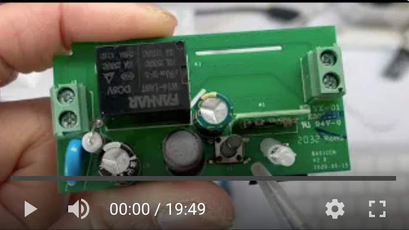
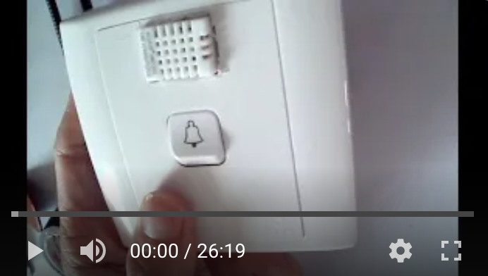
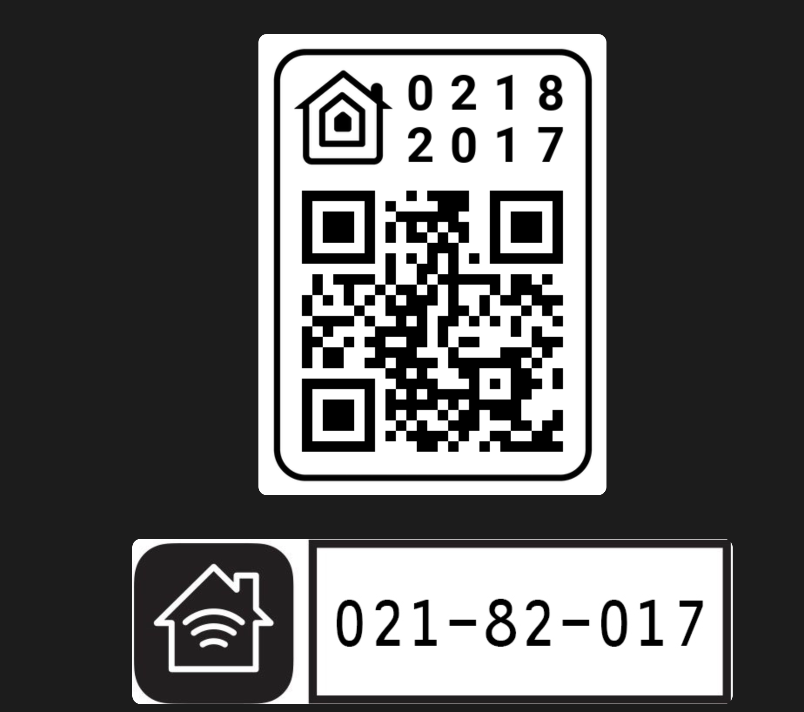

# sonoff_homekit_sw_sensors
sonoff_homekit_sw_sensors
This is a project to Part 1 - Turn a Sonoff basic switch to a homekit light switch with temperature and humidity sensors
Refer to this youtube video that I show how to modify the circuit of the Sonoff basic switch to add the pin sockets for firmware upload, and add the DHT22 temperature and  humidity sensors.

Instruction Videos

Part 1 https://youtu.be/Jow2XkaF1l0

Part 2  https://youtu.be/Ah6cZDGLizI

QR code for homekit set up

HAA WIKI
Refer to the original author's wiki on github for installation steps.

https://github.com/RavenSystem/esp-homekit-devices/wiki

HAA Instalation guide
https://github.com/RavenSystem/esp-homekit-devices/wiki/Installation

How to flash
https://getsmarty.tech/posts/easiest-way-to-flash-your-sonoff-shelly-wemos-or-any-esp8266

HAA JSON configurator
https://glumb.github.io/haa-configurator/

#JSON for Sunoff BASIC  with ESP8285 -  Btn on GPIO0, relay on GPIO 12  DHT22 on GPIO  14

{
  "c": {
    "l": 13,
    "b": [
      {
        "g": 0,
        "t": 5
      }
    ]
  },
  "a": [
    {
      "0": {
        "r": [
          {
            "g": 12
          }
        ]
      },
      "1": {
        "r": [
          {
            "g": 12,
            "v": 1
          }
        ]
      },
      "b": [
        {
          "g": 0
        }
      ],
      "s": 0
    },
    {
      "t": 24,
      "b": [],
      "n": 2,
      "g": 14,
      "j": 30
    }
  ]
}

#JSON for DIY ESP8266 with Btn on GPIO 2, relay on GPIO 0 DHT22 on GPIO 3 

{
  "c": {
    "b": [
      {
        "g": 2,
        "t": 5
      }
    ]
  },
  "a": [
    {
      "0": {
        "r": [
          {
            "g": 0,
            "v": 1
          }
        ]
      },
      "1": {
        "r": [
          {
            "g": 0,
            "v": 0
          }
        ]
      },
      "b": [
        {
          "g": 2,
          "p": 1
        }
      ],
      "s": 0
    },
    {
      "t": 24,
      "b": [],
      "n": 2,
      "g": 3,
      "j": 60
    }
  ]
}

JSON for Sonoff Dual - LED 13,  setup btn GPIO 10, Btn 0 on GPIO 0 controls relay 0 on GPIO 12 , , Btn 1 on GPIO 9 controls relay 1 on GPIO 5 ,   Motion Sensor on GPIO 4  
{
  "c": {
    "l": 13,
    "b": [
      {
        "g": 0,
        "t": 5
      }
    ]
  },
  "a": [
    {
      "0": {
        "r": [
          {
            "g": 12
          }
        ]
      },
      "1": {
        "r": [
          {
            "g": 12,
            "v": 1
          }
        ]
      },
      "b": [
        {
          "g": 0
        }
      ],
      "s": 0
    },
    {
      "0": {
        "r": [
          {
            "g": 5,
            "v": 0
          }
        ]
      },
      "1": {
        "r": [
          {
            "g": 5,
            "v": 1
          }
        ]
      },
      "t": 1,
      "b": [
        {
          "g": 9,
          "t": 1
        }
      ],
      "s": 0
    },
    {
      "t": 12,
      "s": 0,
      "i": 6,
      "f1": [
        {
          "g": 4,
          "t": 1
        }
      ]
    }
  ]
}
